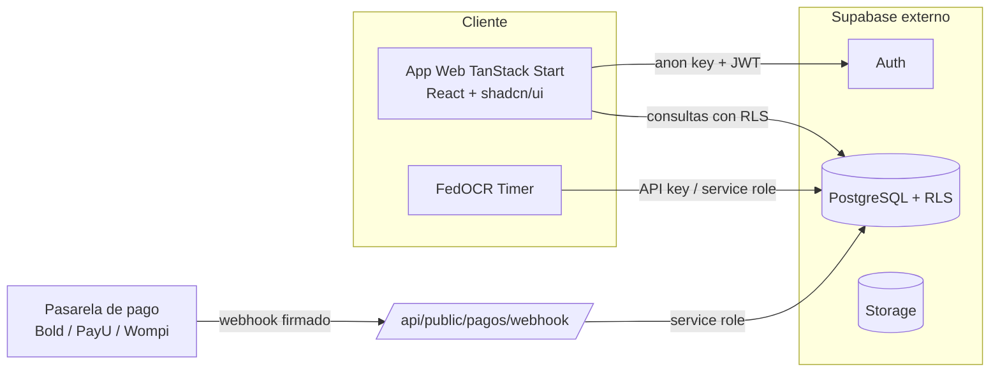

# Arquitectura — FedOCR Colombia

## 1. Visión general

FedOCR Colombia es una plataforma **multi-tenant**. La **federación nacional**
administra el sistema y cada **liga departamental** es un *tenant* con su propia
identidad visual (white-label), sus eventos y sus inscripciones. Los atletas se
registran a una liga, se inscriben y pagan carreras, y compiten por un **ranking
nacional** que otorga clasificación al Mundial de OCR.

El sistema es también el **backend central de datos** del aplicativo
**FedOCR Timer**: el Timer no tiene su propia base de datos, sino que lee las
inscripciones (dorsales y oleadas) y escribe las lecturas de tiempo directamente
sobre este Supabase. Ver [TIMER_INTEGRATION.md](./TIMER_INTEGRATION.md).

## 2. Stack y por qué

- **TanStack Start (React 19) + Vite:** SSR + rutas por archivos, con endpoints
  de servidor (`src/routes/api/...`) para lógica sensible como el webhook de pagos.
- **Supabase como backend:** PostgreSQL gestionado que ya expone API REST y
  Realtime automáticamente, Auth con JWT y **Row Level Security** para el
  aislamiento por tenant. Evita construir y mantener una API propia (Express).
- **Lovable:** hosting y sincronización bidireccional con el editor visual.

## 3. Multi-tenant

- Cada fila de negocio lleva `tenant_id` (liga). El aislamiento **no** se hace en
  el código de la app sino en la base de datos mediante **RLS**, usando dos
  funciones `security definer`:
  - `has_role(uid, rol)` — evita recursión al leer el rol del usuario.
  - `current_tenant_id()` — devuelve el `tenant_id` del perfil autenticado.
- El branding por tenant (colores, logo, banner) se inyecta como CSS Custom
  Properties en tiempo de ejecución (`lib/tenant-theme.ts`).

## 4. Roles

| Rol | Alcance |
|-----|---------|
| `superadmin` | Federación nacional: crea/suspende ligas, comisiones, dashboard global. |
| `admin` | Admin de liga (tenant): branding, eventos, precios, validación de pagos y **cronometraje** de sus eventos. |
| `athlete` | Perfil, afiliación a una liga, inscripción/pago de carreras, consulta de ranking. |

> Para el cronometraje se recomienda añadir a futuro un rol operativo `judge`
> (juez) limitado a escribir `timing_reads`; hoy esa función la cubre `admin`
> del tenant o una **API key** de servicio para el Timer.

## 5. Flujos principales

**Inscripción y pago**
1. El atleta elige evento y modalidad (`event_categories`).
2. `createRegistration()` inserta la inscripción en estado `pending` con un
   `qr_code`/referencia único.
3. Se redirige a la pasarela; al confirmar, la pasarela llama al **webhook**
   firmado (HMAC), que valida la firma y pasa la inscripción a `paid` y registra
   el `payment`.

**Cronometraje (día del evento)**
1. La federación define `checkpoints` (salida, obstáculos, meta) y `waves`.
2. Se asignan dorsales (`bib_number`) y oleada a cada inscripción.
3. FedOCR Timer envía `timing_reads` por cada lectura.
4. Un trigger recalcula el `result` (tiempo neto) de cada inscripción y, al
   cerrar el evento, `recalculate_event_positions()` fija las posiciones.

**Ranking**
- La vista `v_athlete_ranking` acumula `points_awarded` por atleta y marca a los
  clasificados. Con el catálogo de `categories` se puede rankear por edad/nivel.

## 6. Seguridad

- Secretos solo en variables de entorno (nunca en el repo).
- Webhook con verificación de firma **HMAC** y comparación en tiempo constante.
- La `service_role key` se usa **solo** en endpoints de servidor, nunca en el
  cliente.
- Todas las tablas con RLS habilitado; el acceso público es explícito y mínimo.
