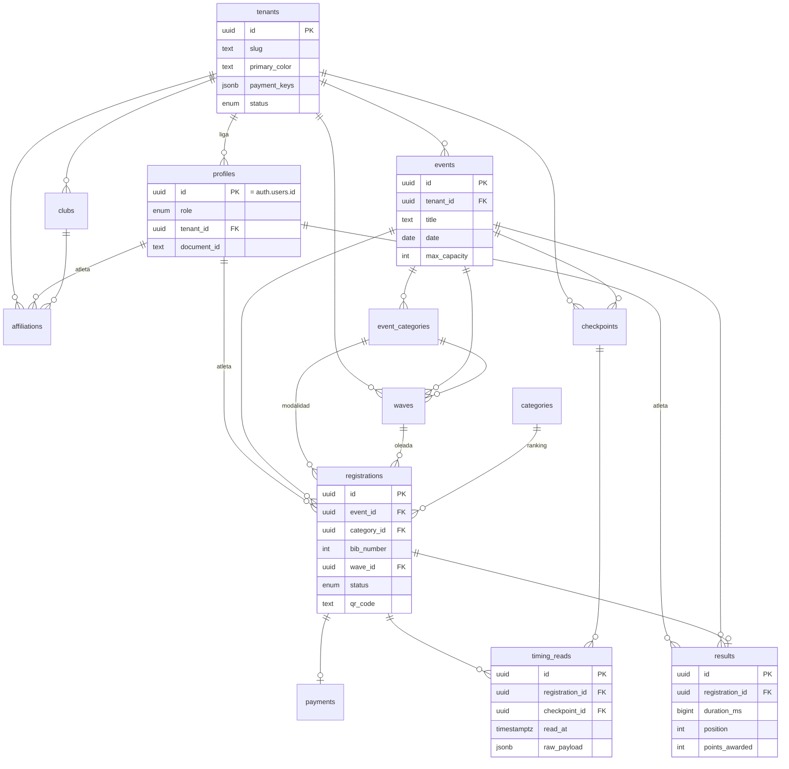

# Base de datos — FedOCR Colombia

PostgreSQL sobre Supabase externo. La **fuente de verdad** es
`supabase/schema.sql` (esquema consolidado). Los cambios se entregan además como
**migraciones incrementales idempotentes** en `supabase/migrations/`.

## Diagrama entidad-relación



## Tablas

### Base (schema.sql original)
| Tabla | Propósito |
|-------|-----------|
| `tenants` | Ligas departamentales (branding, comisiones, llaves de pago). |
| `profiles` | Perfil de usuario (1:1 con `auth.users`), rol y `tenant_id`. |
| `events` | Eventos/carreras de una liga. |
| `event_categories` | Modalidades de un evento (nombre, precio, cupos). |
| `registrations` | Inscripción de un atleta a un evento (estado + `qr_code`). |
| `payments` | Pagos confirmados por webhook. |
| `results` | Resultados por atleta/evento y puntos. |

### Cronometraje (migración `0002_timing`)
| Tabla | Propósito |
|-------|-----------|
| `waves` | Oleadas de salida (hora programada y hora real). |
| `checkpoints` | Puntos de control/obstáculos (salida, intermedios, meta). |
| `timing_reads` | Lecturas de tiempo (append-only) enviadas por FedOCR Timer. |
| `api_keys` | Llaves de servicio para autenticar al Timer. |
| *(alter)* `registrations.bib_number`, `registrations.wave_id` | Dorsal y oleada. |
| *(alter)* `results.duration_ms`, `start_time`, `finish_at`, `status`, `category_rank` | Consolidación de tiempos. |

### Dominio (migración `0003_clubs_affiliations_categories`)
| Tabla | Propósito |
|-------|-----------|
| `categories` | Catálogo nacional de categorías (edad/nivel/género). |
| `clubs` | Clubes de una liga. |
| `affiliations` | Membresía/carnet de un atleta por temporada. |
| *(alter)* `registrations.ranking_category_id` | Categoría de ranking. |

## Funciones y triggers clave

- `set_updated_at()` — mantiene `updated_at`.
- `has_role(uid, rol)`, `current_tenant_id()` — base de las políticas RLS.
- `recalculate_result(registration_id)` — calcula tiempo neto desde `timing_reads`.
- `recalculate_event_positions(event_id)` — fija posiciones del evento.
- Trigger `trg_timing_read_recalc` — recalcula el resultado tras cada lectura.
- Trigger `handle_new_user` — crea el `profile` al registrarse un usuario.

## Row Level Security (RLS)

Toda tabla tiene RLS habilitado. Patrón general:

- **Lectura pública** explícita donde aplica (eventos publicados, categorías,
  clubes, waves/checkpoints, resultados).
- **Gestión por tenant:** `superadmin` o `tenant_id = current_tenant_id()`.
- **Datos del atleta:** el propio atleta (`athlete_id = auth.uid()`).
- El **service_role** (webhook, Timer con service key) **omite** RLS por diseño.

## Estrategia de migraciones

Supabase es externo y se administra **manualmente** desde el SQL Editor.

1. Cada cambio de esquema es un archivo numerado `supabase/migrations/000N_*.sql`,
   **idempotente** (`create ... if not exists`, `add column if not exists`,
   `drop policy if exists` antes de `create policy`, enums con `do $$ ... exception
   when duplicate_object then null; end $$`). Así se puede re-ejecutar sin romper.
2. Tras validar, se consolidan en `supabase/schema.sql` (snapshot completo).
3. Orden de aplicación en una base nueva: ejecutar `schema.sql` **o** las
   migraciones `0001..N` en orden — ambos dejan el mismo estado.

### Aplicar los cambios nuevos
En el **SQL Editor** del proyecto Supabase, ejecuta en orden:
```
supabase/migrations/0002_timing.sql
supabase/migrations/0003_clubs_affiliations_categories.sql
```
(o simplemente re-ejecuta `supabase/schema.sql`, que ya los incluye).

---

## Actualizaciones del modelo (migraciones 0007–0010)

### Eventos con ciclo de vida y aprobación (`0009`)
`events` tiene ahora `status` (`event_status`: `draft`, `pending_federation`,
`approved`, `in_progress`, `finished`, `cancelled`) más `league_approved`,
`federation_approved`, `submitted_at` y `approved_at`. La liga envía el evento a
aprobación (`pending_federation`) y la federación lo aprueba (`approved`, se publica).

### `event_categories` como maestro por carrera (`0010`)
`event_categories` dejó de ser solo una "modalidad con precio": ahora es el **maestro
de categorías de la carrera**, con `gender`, `min_age` y `max_age` (precio opcional,
default 0). Las `registrations.category_id` y las `waves.category_id` apuntan a este
maestro, y la **generación de oleadas** se hace agrupando por estas categorías.

### Resultados de invitado y del Timer (`0006`, `0007`)
`results.source` marca los resultados enviados por el Timer (`'timer'`) para que el
recálculo automático no los sobrescriba; `results.athlete_id` es nullable para
inscripciones sin cuenta de usuario.

### Reglas de negocio en la app
- **Dorsal automático:** al inscribir sin dorsal, se asigna `max(bib)+1` del evento.
- **Generación de oleadas:** por categoría, en bloques de tamaño configurable; borra
  y reasigna. Editable a mano (agregar/borrar oleada, reasignar atletas).
- **Aislamiento:** todas las lecturas del panel usan el cliente Supabase del usuario
  (RLS); solo `recalculate_event_positions` corre con service role.
